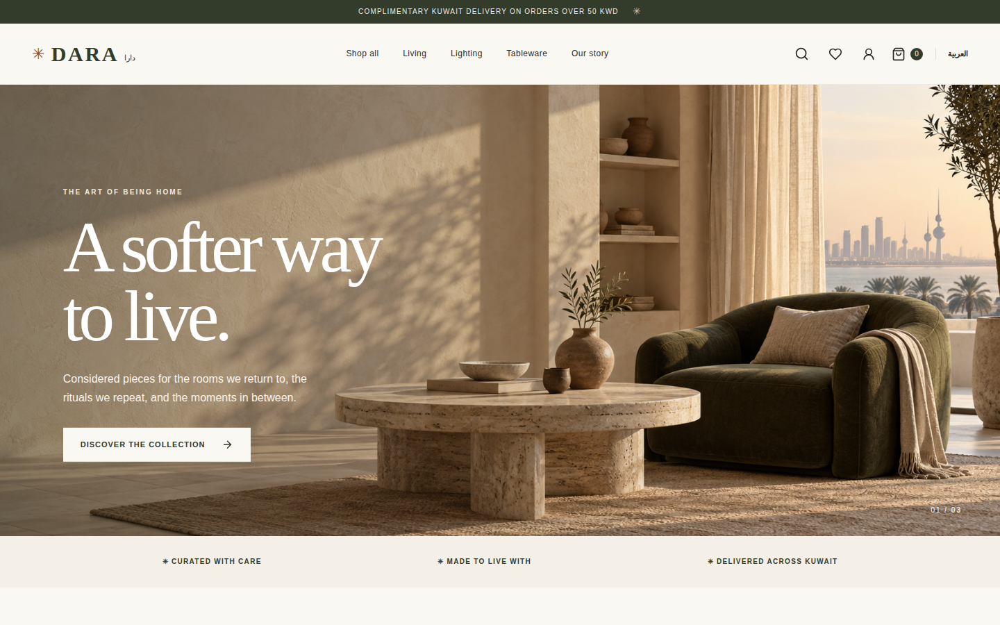
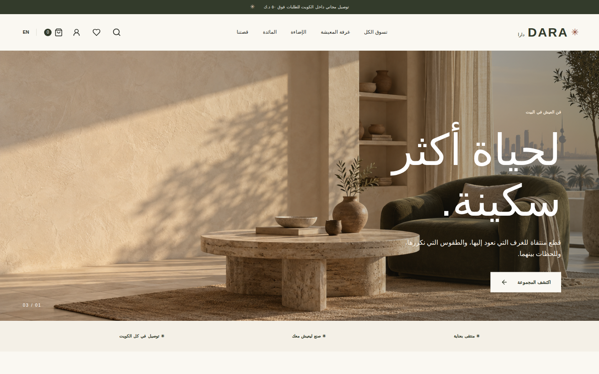

# Dara · دارا

A bilingual home goods storefront and staff studio for a **simulated Kuwait retailer**. Prices are in KWD; checkout records a simulated payment and never charges a card.

## Screenshots

| English storefront | Arabic storefront |
| --- | --- |
| <a href="docs/screenshots/en/home.png"></a> | <a href="docs/screenshots/ar/home.png"></a> |

[Browse screenshots of every storefront and admin view, including mobile layouts](docs/screenshots/README.md).

To recapture them from a running local stack, use `SEED_ADMIN_PASSWORD='your-local-password' node scripts/capture-screenshots.mjs`. This places two simulated orders.

## Local setup

Requirements: Node 24, pnpm 9, PostgreSQL 16+ (or Docker).

```bash
cp .env.example .env
docker compose up -d postgres
set -a; source .env; set +a
pnpm install
pnpm db:migrate
SEED_ADMIN_PASSWORD='choose-a-long-local-password' pnpm db:seed
pnpm dev
```

Set `DATABASE_URL`, `WEB_ORIGIN`, and `NEXT_PUBLIC_API_URL` from `.env.example` in your shell or process manager; pnpm does not load `.env` automatically. The web app runs on `http://localhost:3000`, the API on `http://localhost:4000`, and OpenAPI is at `http://localhost:4000/openapi.json`. The seed creates 125 products and 2,500 SKUs. It creates an admin only when `SEED_ADMIN_PASSWORD` is set, using `SEED_ADMIN_EMAIL` or `admin@dara.local`.

```bash
pnpm typecheck
pnpm test
pnpm build
TEST_API_URL=http://localhost:4000 SEED_ADMIN_PASSWORD='your-local-password' pnpm test
pnpm exec playwright install chromium
pnpm test:e2e
```

The first `pnpm test` runs pricing tests and skips live API tests when `TEST_API_URL` is unset. Browser tests require both apps and the seeded database.

## Repo guide

- `apps/web`: Next.js App Router storefront and staff studio, with `/en` and `/ar` routes.
- `apps/api`: Fastify REST API, Drizzle schema, migrations, seed, email adapter, and tests.
- `packages/shared`: request contracts, money formatting, roles, locales, and design tokens.
- `docs`: architecture, API, data model, security, operations, and design review.
- `EXPLAIN.md`: local detailed walkthrough, intentionally ignored by Git.

The catalog is browsable without the API using a clearly labeled preview set. Cart quotes, checkout, orders, and admin actions require the API and PostgreSQL.

Original Dara hero and three featured product images were made for this project. Other seeded catalog images use remote Unsplash URLs and need network access.

## Deployment

`compose.yaml` provides local PostgreSQL. `deploy/Dockerfile.api`, `deploy/Dockerfile.web`, and `deploy/compose.yaml` provide a starting container deployment; set strong secrets, TLS at the reverse proxy, and persistent PostgreSQL storage. Run `pnpm db:migrate` as a release step before starting the API. See [operations](docs/operations.md).
