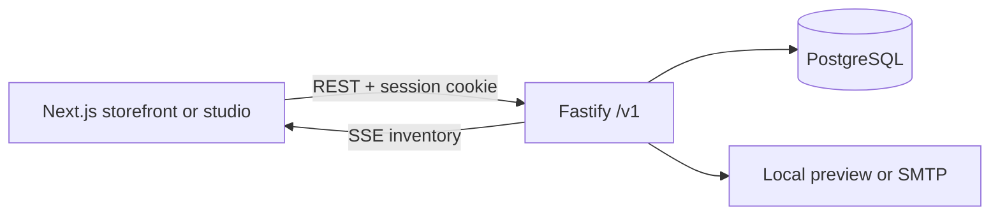

# Architecture

The Next.js App Router serves locale routes at `/en` and `/ar`. A client view renders the storefront screens and uses the versioned Fastify API. The staff studio uses the same API with role checks on every restricted route. The `@dara/shared` package holds input contracts, locale types, money formatting, and palette tokens.

PostgreSQL is the source of truth for prices, stock, orders, sessions, payments, and events. Browser local storage holds only cart selections and favorite slugs. The cart is quoted again against the database before checkout; the browser never supplies an authoritative price.

Checkout obtains an idempotency advisory lock, locks requested variant rows in a consistent order, computes totals from current prices, inserts the order, atomically decrements stock, records line snapshots, simulated payment, stock movements, audit entry, and inventory events in one transaction. Cancellation locks the order and restores stock only when `stock_restored` is false. Inventory events are committed in PostgreSQL and streamed by server-sent events with `Last-Event-ID` resume support.

The email adapter stores local preview messages in PostgreSQL. SMTP is used only when configured; email failure does not roll back a committed order.

## Data flow

The current client is intentionally a compact route driven app. It uses page routes for shareable URLs and React state for filters, cart, and forms. A production expansion can split each screen into server components and move catalog image storage to an object service.
